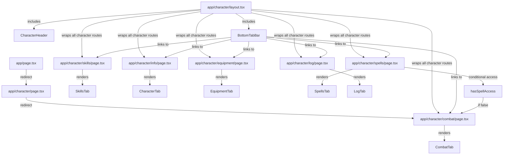
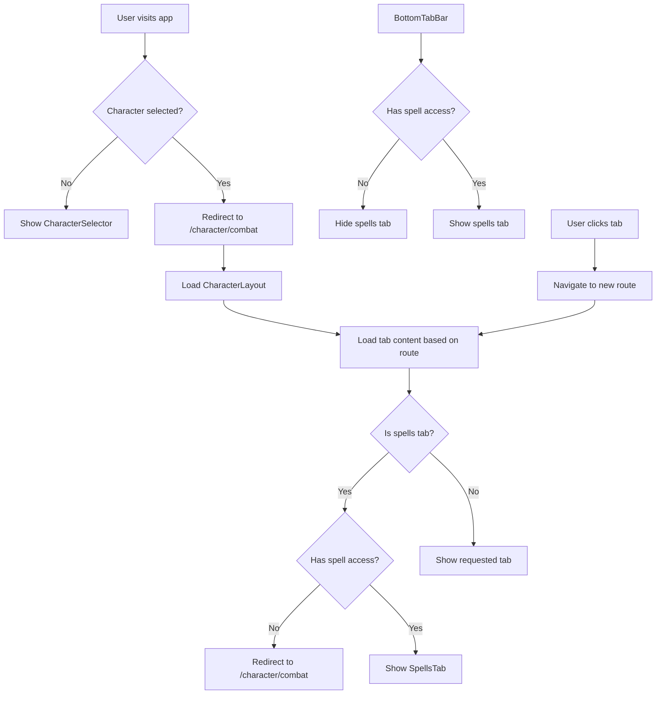

# Route Structure Diagram



# Component Flow Diagram



# Data Flow Diagram

```mermaid
flowchart TD
    A[CharacterService] --> B[CharacterLayout]
    A --> C[Tab Components]
    
    D[UIStateService] --> E[BottomTabBar]
    D --> F[Other UI Components]
    
    G[URL/Route] --> H[Active Tab Selection]
    H --> E
    
    I[Character Data] --> J{Has spell access?}
    J -->|Yes| K[Show SpellsTab in navigation]
    J -->|No| L[Hide SpellsTab in navigation]
    J -->|No & on spells route| M[Redirect to combat]